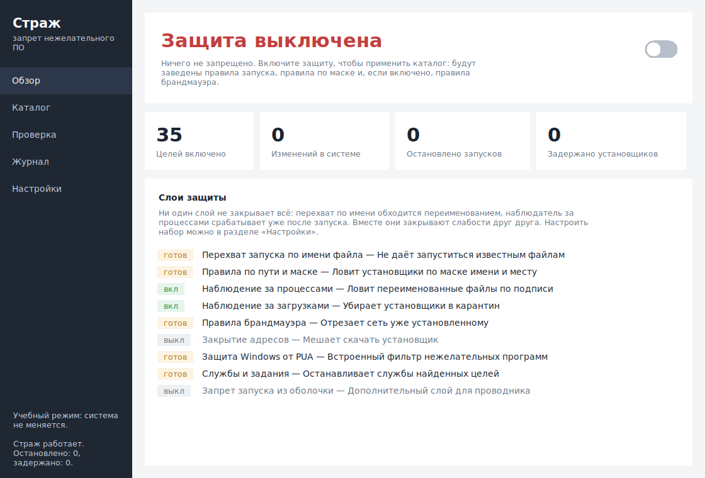
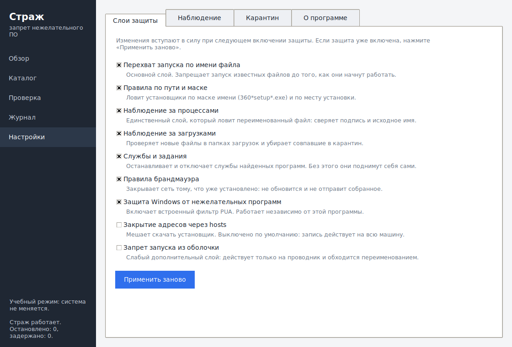
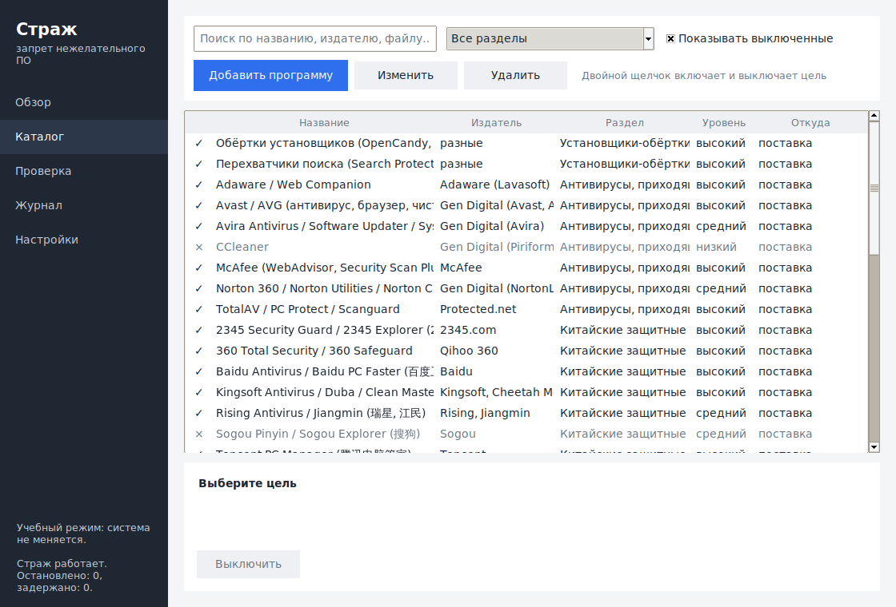
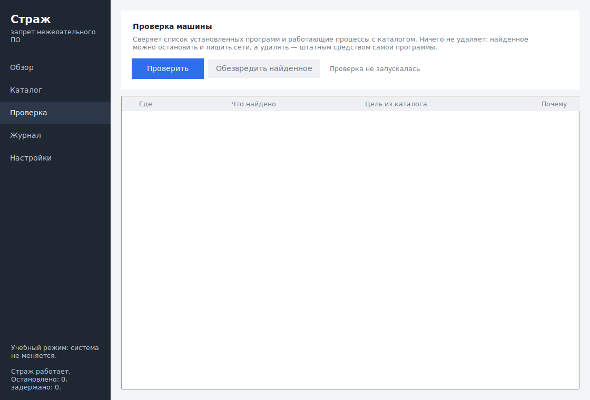

# Страж

Запрет запуска и установки нежелательного и шпионского ПО на уровне системы.
Windows 10 и 11, окно и командная строка, каталог из 39 записей, который
дополняется в два клика.



## Что это и чего это не делает

Программа **запрещает известное**, а не ищет неизвестное. Она не сканирует
файлы эвристиками, не следит за поведением программ и не заменяет антивирус —
наоборот, включает встроенный в Windows фильтр нежелательных программ, который
по умолчанию выключен.

Смысл в другом. Есть класс программ, который антивирус пропускает намеренно:
формально они не вредоносные, ставятся «с согласия пользователя» и имеют
издателя с настоящим сертификатом. Китайские защитные пакеты, антивирусы,
приезжающие довеском к чужому установщику, «ускорители» с вымышленными
находками, обновляльщики драйверов, обёртки установщиков — и отдельно
программы скрытой слежки за человеком, которые продаются легально. Их
приходится не обнаруживать, а именно **не пускать**.

## Как это работает

Ни один способ запретить программу в Windows не работает в одиночку. Перехват
по имени файла обходится переименованием. Правило по пути — переносом.
Наблюдатель за процессами срабатывает уже после запуска. Поэтому слоёв
несколько, и они закрывают слабости друг друга.

| Слой | Что делает | Чего не может |
| --- | --- | --- |
| Перехват запуска по имени файла (IFEO) | Не даёт запуститься известному файлу — до того, как выполнится его первая инструкция. Работает на всех изданиях, включая домашние | Привязан к имени: переименованный файл не поймает |
| Правила по пути и маске (SAFER/SRP) | Ловит установщики по маске (`360*setup*.exe`) и по месту установки | Не знает, кто подписал файл |
| Наблюдение за процессами | Единственный слой, который ловит **переименованный** файл: сверяет `OriginalFilename` из ресурса версии и подпись издателя | Срабатывает уже после запуска |
| Наблюдение за загрузками | Проверяет новые файлы в папках загрузок и убирает совпавшие в карантин — до того, как их запустят | Не видит того, что скачано в обход этих папок |
| Службы и задания | Останавливает и отключает службы найденных программ | Требует прав администратора |
| Правила брандмауэра | Закрывает сеть тому, что уже установлено: не обновится и не отправит собранное | Не мешает работать локально |
| Защита Windows от PUA | Включает встроенный фильтр нежелательных программ | Ведётся базой Microsoft, не нашей |
| Закрытие адресов (hosts) | Мешает скачать установщик. **Выключено по умолчанию** — запись действует на всю машину | Обходится сменой адреса |



Порядок применения не случаен: сперва у уже установленного отбирают службы,
потом закрывают запуск, и лишь затем — сеть и адреса. Иначе служба успеет
подняться и вернуть себе файлы. Каждый слой отключается отдельно: у них
разная цена, и человек вправе решить, какую он готов заплатить.

## Всё обратимо

Каждое изменение записывается в `state.json` **до** того, как будет применено:
что за механизм, какой ключ, какое значение было раньше. «Выключить защиту»
и `strazh-cli revert` идут по этому списку, а не гадают. Чужие значения
возвращаются на место, чужие правила SAFER не трогаются никогда.

Найденные установщики не удаляются, а уезжают в карантин: теряют расширение,
получают записку с объяснением и возвращаются одной кнопкой. Удаление —
единственное необратимое действие, и программа его не делает.

## Чего программа не заблокирует никогда

Опечатка в правиле не должна оставлять человека без рабочего стола. Список
неприкосновенных имён — `lsass.exe`, `winlogon.exe`, `explorer.exe`,
`svchost.exe`, `MsMpEng.exe` и ещё полсотни — зашит в
[`core/models.py`](src/strazh/core/models.py) и проверяется в трёх местах:
при чтении каталога, при построении индекса и при построении плана. Маска
`*.exe` не «случайно работает» — она отбрасывается, потому что заведомо
накрывает `lsass.exe`.

Проверка [`test_wide_mask_does_not_take_down_the_system`](tests/test_matcher.py)
держит это обещание в сборке.

## Установка

Скачайте архив со [страницы выпусков](../../releases), распакуйте, запустите
`Strazh.exe`. Программа попросит права администратора: без них не завести
правила запуска в общей ветке реестра.

Из исходного кода:

```powershell
git clone https://github.com/Aleck59/unwant_zapret
cd unwant_zapret
pip install -e .
python -m strazh          # окно
python -m strazh status   # командная строка
```

Зависимостей у программы нет — только стандартная библиотека Python 3.11+.
У программы, которая работает с правами системы, каждая внешняя библиотека —
это ещё один способ ей навредить.

## Как добавить свою программу

Три способа, от самого быстрого к самому подробному.

**Через окно.** Раздел «Каталог» → «Добавить программу». Достаточно названия
и списка файлов; остальные поля — маски установщиков, издатель, пути, службы,
адреса — заполняются по желанию.



**Через командную строку:**

```powershell
strazh-cli add "Плохая программа" --exe bad.exe --exe badsvc.exe
strazh-cli apply
```

**Файлом.** Положите `.json` в `C:\ProgramData\Strazh\catalog.d\` — эта папка
переживает обновление программы. Формат описан в
[docs/CATALOG.md](docs/CATALOG.md), проверить файл можно командой
`python tools/validate_catalog.py C:\ProgramData\Strazh\catalog.d`.

```json
{
  "version": 1,
  "targets": [
    {
      "id": "moya-gadost",
      "name": "Моя гадость",
      "category": "other",
      "severity": "high",
      "why": "Ставится довеском и меняет настройки браузера",
      "match": {
        "executables": ["bad.exe"],
        "installers": ["bad*setup*.exe"],
        "publishers": ["Bad Software Ltd"],
        "services": ["BadSvc"]
      },
      "actions": ["block_exec", "block_install", "neutralize_services"]
    }
  ]
}
```

Записи из поставки не удаляются, а выключаются двойным щелчком: удаление
вернулось бы со следующим обновлением. Выключение хранится в настройках и
обновление переживает.

## Что уже в каталоге

39 записей в девяти разделах. У каждой — объяснение, **почему** она в списке,
и ссылки на источники; согласиться с объяснением или нет, решает человек.

| Раздел | Записей | Примеры |
| --- | --- | --- |
| Китайские защитные пакеты | 8 | 360 Total Security, Tencent PC Manager, Baidu, Kingsoft/Duba, 2345, Xunlei, Rising |
| Антивирусы, приходящие в комплекте | 7 | McAfee, Avast/AVG, Norton, Avira, TotalAV, Adaware Web Companion |
| Мнимая защита | 5 | Segurazo/SAntivirus, ByteFence, SpyHunter, Reimage/Restoro/Fortect |
| «Ускорители» и обновляльщики драйверов | 6 | IObit, DriverPack Solution, Driver Easy, WinZip Utilities, Hola VPN |
| Спутники русскоязычных установщиков | 4 | Спутник@Mail.ru, Amigo, Менеджер браузеров, обёртки установщиков |
| Слежка за человеком | 6 | mSpy, FlexiSPY, Spyrix, Hoverwatch/Refog, Ardamax и другие перехватчики |
| Удалённый доступ, добыча криптовалюты, обход лицензий | 3 | Ammyy Admin, XMRig, KMSPico |

Четыре записи выключены по умолчанию и объясняют, почему: Sogou (осознанно
используемый способ ввода), CCleaner, средства слежения за сотрудниками
(на рабочей машине могут стоять законно) и средства удалённого доступа
(ими пользуются администраторы).

Записи вроде McAfee, Avast или Norton — не обвинение в зловредности.
Компании настоящие, причина одна и та же: продукт массово попадает на машину
довеском к чужому установщику, ставит службы и расширения браузера, а
удаляется отдельной утилитой издателя. Не согласны — выключите запись.

## Проверка машины

Защиту включили сегодня, а «360» стоит с прошлого года: запрет запуска ему
уже не помеха, служба поднимет его сама. Раздел «Проверка» сверяет список
установленных программ и работающие процессы с каталогом и предлагает
обезвредить найденное — остановить, отключить службы, закрыть сеть. Файлы
остаются на месте: удалять программу должен её собственный деинсталлятор.



## Командная строка

```
strazh-cli status                     состояние защиты и каталога
strazh-cli list [--all] [--category]  список целей
strazh-cli show <id>                  подробности о цели
strazh-cli apply [--dry-run] [-v]     включить защиту (или показать план)
strazh-cli revert                     выключить и снять все изменения
strazh-cli scan                       найти цели среди установленного
strazh-cli check <путь>               проверить один файл
strazh-cli add <имя> --exe <файл>     добавить свою цель
strazh-cli enable|disable <id>        включить или выключить цель
strazh-cli journal [-n N]             последние события
strazh-cli watch                      фоновый страж
```

`strazh-cli apply --dry-run` показывает точный список того, что произойдёт,
не меняя ничего. План считает тот же код, что и применение, — «показать» и
«сделать» не могут разойтись.

## Где что лежит

| Что | Где |
| --- | --- |
| Каталог из поставки | внутри программы, обновляется вместе с ней |
| Свои цели | `C:\ProgramData\Strazh\catalog.d\` |
| Настройки и выключенные записи | `C:\ProgramData\Strazh\settings.json` |
| Список внесённых изменений | `C:\ProgramData\Strazh\state.json` |
| Журнал | `C:\ProgramData\Strazh\journal.jsonl` |
| Карантин | `C:\ProgramData\Strazh\quarantine\` |

## Разработка

```bash
pip install -e ".[dev]"
pytest                          # ядро, каталог, план, наблюдатели
ruff check . && ruff format --check .
mypy                            # проверяется как Windows
python tools/validate_catalog.py
xvfb-run python tools/gui_smoke.py   # окно на подставном экране
```

Ядро — сопоставитель, каталог, счёт плана, состояние — не знает ни о Windows,
ни о реестре. Поэтому самая ответственная часть программы проверяется на любой
машине, а не только на той, где программа в итоге работает. Windows остаётся
за границей [`enforce/windows/`](src/strazh/enforce/windows/), и вместо неё
в проверках работает распорядитель, который считает тот же план, но ничего
не меняет.

Подробнее — [docs/ARCHITECTURE.md](docs/ARCHITECTURE.md) и
[docs/MECHANISMS.md](docs/MECHANISMS.md).

## Сборка и выпуск

Проверки идут на каждую отправку: разбор кода и типов, проверка каталога,
прогон на Ubuntu и Windows под Python 3.11 и 3.12, подъём окна на подставном
экране и сборка под Windows.

Выпуск делает тег `v1.0.0`: сборка на GitHub, сверка версии в теге с версией
в коде, прогон проверок, PyInstaller, архив и контрольные суммы в Releases.
Собирается на GitHub, а не на машине разработчика, ровно по одной причине:
программа ставится с правами системы, и тот, кто её скачивает, должен уметь
проверить, из какого исходного кода она собрана.

## Источники списка

- [List of Common Potentially Unwanted Programs (PUPs) — ToolsLib](https://blog.toolslib.net/2025/06/03/list-of-common-potentially-unwanted-programs-pups/)
- [Potentially unwanted program — Wikipedia](https://en.wikipedia.org/wiki/Potentially_unwanted_program)
- [What is a PUP? — Malwarebytes](https://www.malwarebytes.com/cybersecurity/basics/what-is-pup)
- [PUPs: Potentially Unwanted Programs — Panda Security](https://www.pandasecurity.com/en/security-info/malware/pup/)
- [Qihoo 360 — Wikipedia](https://en.wikipedia.org/wiki/Qihoo_360) и [360 v. Tencent](https://en.wikipedia.org/wiki/360_v._Tencent)
- [Chinese antivirus: is it trustworthy? — MalwareTips](https://malwaretips.com/threads/chinese-antivirus-is-it-trustworthy-to-use-it.60189/)
- [What is stalkerware? — Comparitech](https://www.comparitech.com/blog/vpn-privacy/what-is-stalkerware/)
- [FlexiSPY: the spyware tool crossing the line — iVerify](https://iverify.io/blog/flexispy-the-spyware-tool-crossing-the-line-between-security-and-crime)
- [Digital stalking: how to detect spyware and stalkerware — Petronella](https://petronellatech.com/blog/digital-stalking-detection-guide/)

Технические сведения о механизмах:

- [Image File Execution Options — Microsoft Learn](https://learn.microsoft.com/en-us/previous-versions/windows/desktop/xperf/image-file-execution-options)
- [An Introduction to Image File Execution Options — Malwarebytes Labs](https://www.malwarebytes.com/blog/news/2015/12/an-introduction-to-image-file-execution-options)
- [Software Restriction Policies alias SAFER](https://skanthak.hier-im-netz.de/SAFER.html)

## Лицензия

MIT. См. [LICENSE](LICENSE).
